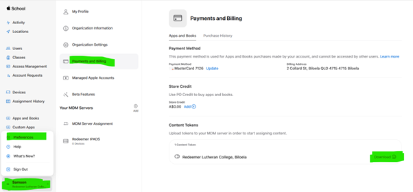
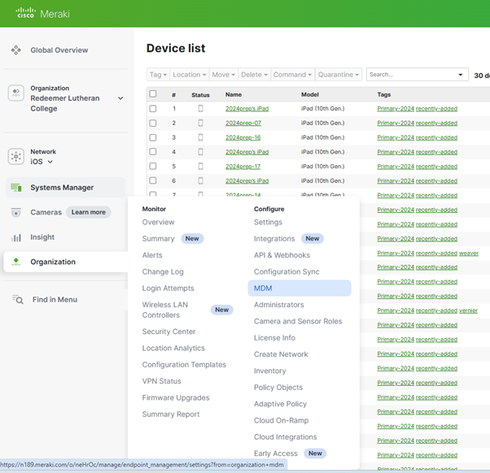

# Meraki

## How to synchronize Apple school account to Meraki
1.	Login to https://school.apple.com/ ,  with the apple school manager account. 
2.	Click on the profile below and then preferences, click on the payment and billing, Download the Content token below for Redeemer Lutheran College, Biloela.

 

 
3.	Log into Meraki with the admin account to gain access to the “Organisation” page. 

4.	Click “MDM” 

 
 
5.	In the MDM page, scroll down to the Apple VPP accounts and click “Add account”. Upload the file you downloaded from Apple School account and add.

